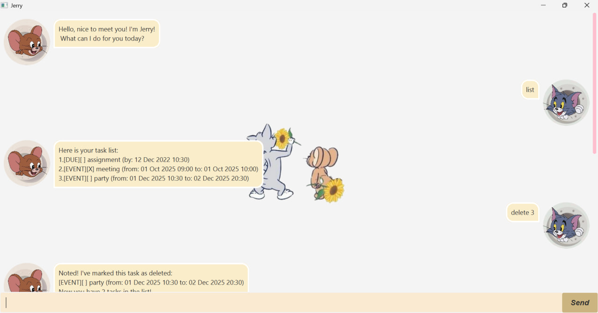

# Jerry User Guide

<<<<<<< HEAD

=======


Meet **Jerry** - your intelligent assistant that **manages all your task** in a flash! 
Starting from a general to-dos, to scheduling events and tracking deadlines, Jerry got your back! :index_pointing_at_the_viewer:
And here's a simple guide to take you through on how to use Jerry more effectively! :star2:
>>>>>>> 7cc137a53265e90b21495bcac992f2da4c4506dd

Meet **Jerry** - your intelligent assistant that **manages all your task** in a flash!
Starting from a general to-dos, to scheduling events and tracking deadlines, Jerry got your back!🫵
And here's a simple guide to take you through on how to use Jerry more effectively!🌟

---

## Getting started is easy,
1. download it from *[here](https://github.com/michellee15/ip/releases/tag/A-Jar)*.
2. double-click it.
3. add your tasks.
4. let it manage your tasks for you.😄

<<<<<<< HEAD
## Features

### 📃 Add `todo` Task
Add simple tasks that don't require date and time to the list
=======
---

## Features 

### :white_check_mark: Add `todo` Task
Add simple tasks that don't require date and time to the list

- **Command format:**
`todo <task description>`

- **Example:** 
`todo laundry`

- **Expected output**
```
Great! New task added:
[TODO][] laundry
Now you have 1 in your list :)

```

---

### :bookmark_tabs: Add `deadline` Task
Add tasks that has a due date to the list

- **Command format:**
`deadline <task description> /by yyyy-MM-dd HH:mm`

- **Example:**
`deadline assignment /by 2025-12-12 23:59`

- **Expected output**
```
Great! New task added:
[DUE][] assignment (by: 12 Dec 2025 23:59)
Now you have 2 in your list :)

```

---

### :spiral_calendar: Add `event` Task
Add an event that requires date and time frame into the list

- **Command format:**
`event <task description> /from yyyy-MM-dd HH:mm to yyyy-MM-dd HH:mm`

- **Example:**
`event party /from 2025-12-01 10:30 to 2025-12-02 10:30`

- **Expected output**
```
Great! New task added:
[EVENT][] party (from: 01 Dec 2025 10:30 to: 02 Dec 2025 10:30)
Now you have 3 in your list :)

```

---

### `mark` Task as Completed 
To update the list that task has been accomplished

- **Command format:**
`mark <task number>`

- **Example:**
`mark 1`

- **Expected output**
```
Yay! One task down:
[TODO][X] laundry 

```

---

### `unmark` Task as Not Completed 
To update the list that task has yet to be accomplished

- **Command format:**
`unmark <task number>`

- **Example:**
`unmark 1`

- **Expected output**
```
Noted! I've marked this task as undone:
[TODO][] laundry 

```

---

### `delete` Task 
To remove task from the list permanently

- **Command format:**
`delete <task number>`

- **Example:**
`delete 1`

- **Expected output**
```
Noted! I've marked this task as deleted:
[TODO][] laundry 
Now you have 2 tasks in the list!

```

> :information_source: **Note**: <task number> should be in between 1 and the total number of the tasks in the list

---

### `list` all Tasks
To display all the tasks in the list 

- **Command format:**
`list`

- **Example:**
`list`

- **Expected output**
```
Here is your task list:
1. [TODO][] laundry
2. [DUE][] assignment (by: 12 Dec 2025 23:59)
3. [EVENT][] party (from: 01 Dec 2025 10:30 to: 02 Dec 2025 10:30)

```
> :information_source: **Note**: tasks in the list are automatically sorted in alphabetical order based on the task description

---

### `find` Task 
To all the tasks based on keywords entered by user 

- **Command format:**
`find <keyword>`

- **Example:**
`find book`

- **Expected output**
```
Here are the matching tasks in your list:
1. [TODO][] buy book
2. [DEADLINE][] return book (by: 20 Nov 2025 12:30)

```

---

### `bye` command
To exit and close Jerry

- **Command format:**
`bye`

- **Example:**
`bye`

- **Expected output**
`Bye! See you next time :D`

---

## FAQ

### Q1: Does it support case-sensitive commands?

Answer: Yes, it does! You can enter commands with all caps or mixed of lower and upper case 

### Q2: Are the datas stored temporarily?

Answer: No, Jerry saves everything in `data/jerry.txt`, so you don't have to worry!
>>>>>>> 7cc137a53265e90b21495bcac992f2da4c4506dd

- **Command format:**
  `todo <task description>`

- **Example:**
  `todo laundry`

- **Expected output**
```
Great! New task added:
[TODO][] laundry
Now you have 1 in your list :)
```

---

###  📚 Add `deadline` Task
Add tasks that has a due date to the list

- **Command format:**
  `deadline <task description> /by yyyy-MM-dd HH:mm`

- **Example:**
  `deadline assignment /by 2025-12-12 23:59`

- **Expected output**
```
Great! New task added:
[DUE][] assignment (by: 12 Dec 2025 23:59)
Now you have 2 in your list :)
```

---

### 🗓 Add `event` Task
Add an event that requires date and time frame into the list

- **Command format:**
  `event <task description> /from yyyy-MM-dd HH:mm to yyyy-MM-dd HH:mm`

- **Example:**
  `event party /from 2025-12-01 10:30 to 2025-12-02 10:30`

- **Expected output**
```
Great! New task added:
[EVENT][] party (from: 01 Dec 2025 10:30 to: 02 Dec 2025 10:30)
Now you have 3 in your list :)
```

---

### ✅ `mark` Task as Completed
To update the list that task has been accomplished

- **Command format:**
  `mark <task number>`

- **Example:**
  `mark 1`

- **Expected output**
```
Yay! One task down:
[TODO][X] laundry 

```

---

### ❎ `unmark` Task as Not Completed
To update the list that task has yet to be accomplished

- **Command format:**
  `unmark <task number>`

- **Example:**
  `unmark 1`

- **Expected output**
```
Noted! I've marked this task as undone:
[TODO][] laundry 
```

---

### 🗑 `delete` Task
To remove task from the list permanently

- **Command format:**
  `delete <task number>`

- **Example:**
  `delete 1`

- **Expected output**
```
Noted! I've marked this task as deleted:
[TODO][] laundry 
Now you have 2 tasks in the list!
```

> ℹ️ **Note**: <task number> should be in between 1 and the total number of the tasks in the list

---

### 📑 `list` all Tasks
To display all the tasks in the list

- **Command format:**
  `list`

- **Example:**
  `list`

- **Expected output**

```
Here is your task list:
1. [TODO][] laundry
2. [DUE][] assignment (by: 12 Dec 2025 23:59)
3. [EVENT][] party (from: 01 Dec 2025 10:30 to: 02 Dec 2025 10:30)
```
> ℹ️ **Note**: tasks in the list are automatically sorted in alphabetical order based on the task description

---

### 🔍 `find` Task
To all the tasks based on keywords entered by user

- **Command format:**
  `find <keyword>`

- **Example:**
  `find book`

- **Expected output**
```
Here are the matching tasks in your list:
1. [TODO][] buy book
2. [DEADLINE][] return book (by: 20 Nov 2025 12:30)
```

---

### 👋 `bye` command
To exit and close Jerry

- **Command format:**
  `bye`

- **Example:**
  `bye`

- **Expected output**
  `Bye! See you next time :D`

---

## FAQ ❔

### Q1: Does it support case-sensitive commands?

Answer: Yes, it does! You can enter commands with all caps or mixed of lower and upper case

### Q2: Are the datas stored temporarily?

Answer: No, Jerry saves everything in `data/jerry.txt`, so you don't have to worry!